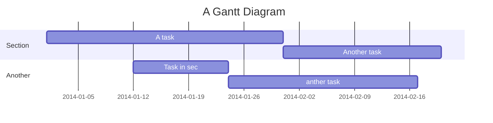

Fuelator
===
**2019-20 NCTU ICP Final Project**

**Creater: *0816153 陳琮方***

## Table of Contents

You can also watch this [file](https://hackmd.io/CoiOTyTDRe-o_N9AsHgcrQ?view) via HackMD.

Also, you can watch [Demo](https://youtu.be/nFaFNjdoRf4)

[TOC]

## Implementation Guide

### Requirements
#### Environment
```
python version: 3.7.3
```
To check your python version, you can use command
```
python -V
```

#### Require Packages:
```
numpy
matplotlib
bs4 (or beautifulsoup)
json
googleapiclient
gspread
oauth2client
datetime
django (Version 3.0)
imgurpython
```
Your should install some packages by using following command
```
pip3 install [Package Name]
```

#### Line Bot API
* Apply an new Line Officail Account
* Get the following  things:
    * Channel access token
    * Channel secret
    * Webhook url (Now is empty)
* Line Bot setting


#### Google Sheet API
* Enable Google Sheet API
* Get an api token

```
Account Name: [Any Name you want]
Account ID  : [Auto generate]
Key Type    : Json
```

```
You will get a JSON file. 
```
Put this file [here](https://github.com/andy89923/Fuelator-Public/blob/master/echobot/Fuelator_key.json)

* Open an new google sheet in your google drive
    * Get Spread Sheet Key
    * Share this sheet to the former account ID
```
Copy the url like:
https://docs.google.com/spreadsheets/d/[SpreadSheetKey]/edit#gid=0
```


#### Imgur API
* Apply a imgur api and get two things:
    * Client-ID
    * Client-Secret


### Setup
* clone this Repositories
* Modify [info.json](https://github.com/andy89923/Fuelator-Public/blob/master/echobot/Model/info.json) file to your own api key
* Modify [settings.py]() to your Line Secret, token
* Run this command in Fuelator/
```
(sudo) python3.7 manage.py runserver
```
* Because LineBot Webhook needs https, there are many tools to use, we use [ngrok](https://ngrok.com) here
```
./ngrok http 8000
```

* Put this url in LineBot webhook
```
https://XXXXX.ngrok.io/echobot/callback/
```

### Finish Everything


Works flows
---

### Fuelator add record

```sequence
User -> Line: "95 34.7 112470.8"
Line -> Server: "95 34.7 112470.8"
Note right of Server: serviceHandler
Note right of Server: gasModel
Server -> GSModel: [Data]
GSModel -> Server: "Success"
Server -> Line: "Success"
Line -> User: "Success"
```

### Fuelator get user's report

```sequence
User -> Line: ["c" or "p"]
Line -> Server: ["c" or "p"]
Note right of Server: serviceHandler
Server -> GSModel: [request]
GSModel -> Server: [Data]
Note left of Server: make plot
Server -> Line: Report url
Line -> User: "Report.png"
```


Project Timeline
---


## Appendix and FAQ

:::info
**Find this document incomplete?** 
Send an email to ctfang.cs08@nctu.edu.tw
:::

###### tags: `Project` `Documentation`
